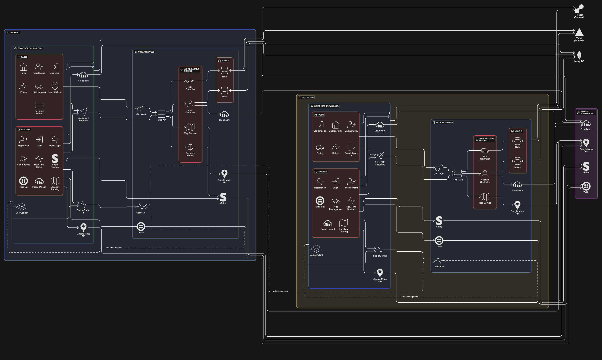

# Ride-Sharing App

A full-stack ride-sharing application with real-time tracking, payments, and conference calling between users and captains (drivers).

---

## Architecture Diagram

---

## Tech Stack

### Frontend

- **React** (Vite)
- **Tailwind CSS**
- **Axios** (API requests)
- **Socket.io-client** (real-time updates)
- **Stripe.js** (payments)
- **React Router** (routing)

### Backend

- **Node.js** (Express)
- **MongoDB** (Mongoose)
- **Socket.io** (real-time communication)
- **Stripe** (payment processing)
- **Twilio** (conference calls)
- **Cloudinary** (image uploads)
- **JWT** (authentication)
- **dotenv** (environment variables)

---

# Project Structure

## Environment Variables

See [`DEPLOYMENT.md`](DEPLOYMENT.md) and `Backend/env.example` for all required variables.

---

## API Endpoints

### Authentication

- **JWT required** for protected endpoints (header: `Authorization: Bearer <token>` or cookie `token`).

---

### User Endpoints (`/users`)

| Method | Endpoint                | Description                           |
| ------ | ----------------------- | ------------------------------------- |
| POST   | `/register`             | Register a new user                   |
| POST   | `/login`                | Login user, returns JWT               |
| GET    | `/profile`              | Get authenticated user profile        |
| GET    | `/logout`               | Logout user, blacklist token          |
| PUT    | `/update-phone`         | Update user phone number              |
| PUT    | `/update-profile-image` | Upload/update profile image           |
| POST   | `/initiate-call`        | Initiate conference call to captain   |
| POST   | `/voice`                | Twilio webhook for user voice         |
| POST   | `/user-voice`           | Twilio webhook for user conference    |
| POST   | `/captain-voice`        | Twilio webhook for captain conference |
| POST   | `/call-status-callback` | Twilio call status updates            |
| POST   | `/recording-callback`   | Twilio recording status               |
| POST   | `/conference-status`    | Twilio conference status              |

---

### Captain Endpoints (`/captains`)

| Method | Endpoint                | Description                           |
| ------ | ----------------------- | ------------------------------------- |
| POST   | `/register`             | Register a new captain                |
| POST   | `/login`                | Login captain, returns JWT            |
| GET    | `/profile`              | Get authenticated captain profile     |
| GET    | `/logout`               | Logout captain, blacklist token       |
| PUT    | `/location`             | Update captain location               |
| PUT    | `/availability`         | Update captain availability           |
| GET    | `/statistics`           | Get captain statistics                |
| GET    | `/call-history`         | Get captain call history              |
| POST   | `/initiate-call`        | Initiate call to user                 |
| POST   | `/join-conference`      | Join conference call                  |
| POST   | `/call-status-callback` | Twilio call status updates            |
| POST   | `/recording-callback`   | Twilio recording status               |
| POST   | `/conference-status`    | Twilio conference status              |
| POST   | `/voice`                | Twilio webhook for captain voice      |
| POST   | `/voice-handler`        | Twilio voice handler                  |
| POST   | `/captain-voice`        | Twilio webhook for captain conference |

---

### Ride Endpoints (`/rides`)

| Method | Endpoint           | Description                         |
| ------ | ------------------ | ----------------------------------- |
| POST   | `/create`          | Create a new ride                   |
| GET    | `/get-fare`        | Get fare estimate                   |
| POST   | `/confirm`         | Captain confirms ride               |
| GET    | `/start-ride`      | Captain starts ride                 |
| POST   | `/end-ride`        | Captain ends ride                   |
| GET    | `/details/:rideId` | Get ride details (with coordinates) |
| GET    | `/route`           | Get route between two points        |

---

### Maps Endpoints (`/maps`)

| Method | Endpoint             | Description                          |
| ------ | -------------------- | ------------------------------------ |
| GET    | `/get-coordinates`   | Get coordinates for address          |
| GET    | `/get-distance-time` | Get distance/time between addresses  |
| GET    | `/get-suggestions`   | Get address autocomplete suggestions |

---

### Payment Endpoints (`/payments`)

| Method | Endpoint                  | Description                   |
| ------ | ------------------------- | ----------------------------- |
| POST   | `/create-payment-intent`  | Create Stripe payment intent  |
| POST   | `/process-payment`        | Process payment               |
| POST   | `/confirm-payment`        | Confirm payment               |
| GET    | `/payment-status/:rideId` | Get payment status for a ride |

---

## Real-Time Features

- **Socket Events**: Live location updates, ride status changes
- **Conference Calls**: Twilio-powered calls between user and captain
- **Live Route Tracking**: Google Maps API for route lines

---

## Stripe Payment Integration

- Users pay for rides via Stripe
- Payment status tracked in ride model
- Captains can only finish rides after payment

---

## Conference Call Feature

- Users can call captains via conference call (Twilio)
- Both parties receive calls and join the same conference
- Calls are recorded for safety

---

## Deployment

See [`DEPLOYMENT.md`](DEPLOYMENT.md) for full deployment instructions and environment variable setup.

---
